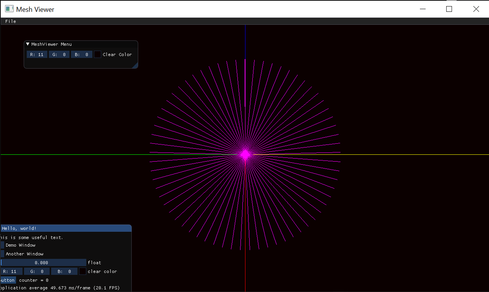
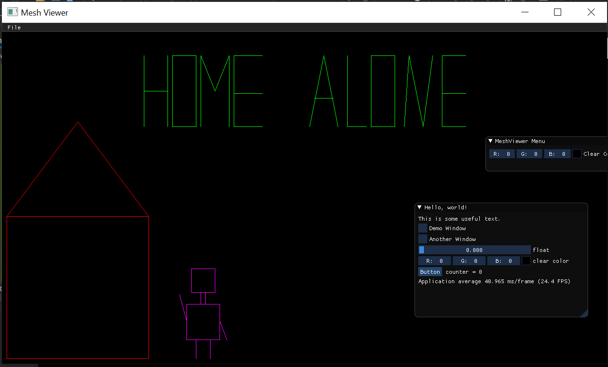

# Assignment1Report part1


### The Implementation of drawLine function using Bresenham’s algorithm :

```
void Renderer::DrawLine(const glm::ivec2& p1, const glm::ivec2& p2, const glm::vec3& color)
{
	// TODO: Implement bresenham algorithm

	int x0 = (int)p1[0], y0 = (int)p1[1];
	int x1 = (int)p2[0], y1 = (int)p2[1];
	int dx = x1 - x0; //delta x
	int	dy = y1 - y0; //delta y

	if (abs(dy) < abs(dx))
	{
		if (x1 > x0)
		{
			int yi = 1;
			if (dy < 0)
			{
				yi = -1;
				dy = -dy;
			}
			int D = (2 * dy) - dx; 
			int y = y0;
			int x = x0;
			while (x <= x1)
			{
				Renderer::PutPixel(x, y, color);
				if (D > 0)
				{
					y = y + yi;
					D = D + (2 * (dy - dx));
				}
				else
					D = D + (2 * dy);
				x++;
			}
		}
		else
		{
			dx = x0 - x1;
			dy = y0 - y1;
			int	yi = 1;
			if (dy < 0)
			{
				yi = -1;
				dy = -dy;
			}

			int D = (2 * dy) - dx; 
			int y = y1;
			int x = x1;
			while (x <= x0)
			{
				Renderer::PutPixel(x, y, color);
				if (D > 0)
				{
					y = y + yi;
					D = D + (2 * (dy - dx));
				}
				else
					D = D + (2 * dy);

				x++;
			}
		}
	}
	else
	{
		if (y1 > y0)
		{
			int	xi = 1;
			if (dx < 0)
			{
				xi = -1;
				dx = -dx;
			}
			int D = (2 * dx) - dy;
			int x = x0;
			int y = y0;
			while (y <= y1)
			{
				Renderer::PutPixel(x, y, color);
				if (D > 0)
				{
					x = x + xi;
					D = D + (2 * (dx - dy));
				}
				else
					D = D + (2 * dx);
				y++;
			}
		}
		else
		{
			dx = x0 - x1;
			dy = y0 - y1;
			int	xi = 1;
			if (dx < 0)
			{
				xi = -1;
				dx = -dx;
			}
			int D = (2 * dx) - dy;
			int x = x1;
			int y = y1;
			while (y <= y0)
			{
				Renderer::PutPixel(x, y, color);
				if (D > 0)
				{
					x = x + xi;
					D = D + (2 * (dx - dy));
				}
				else
					D = D + 2 * dx;
				y++;
			}
		}
	}
}
```

### A picture of the sanity check results :
 
lines in all directions with radius = 250 and step size = 65.

---
### A drawing of my own choic :

