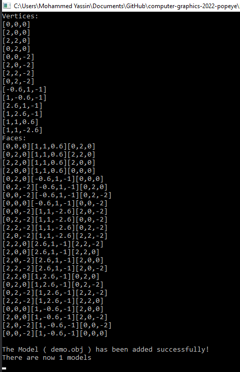
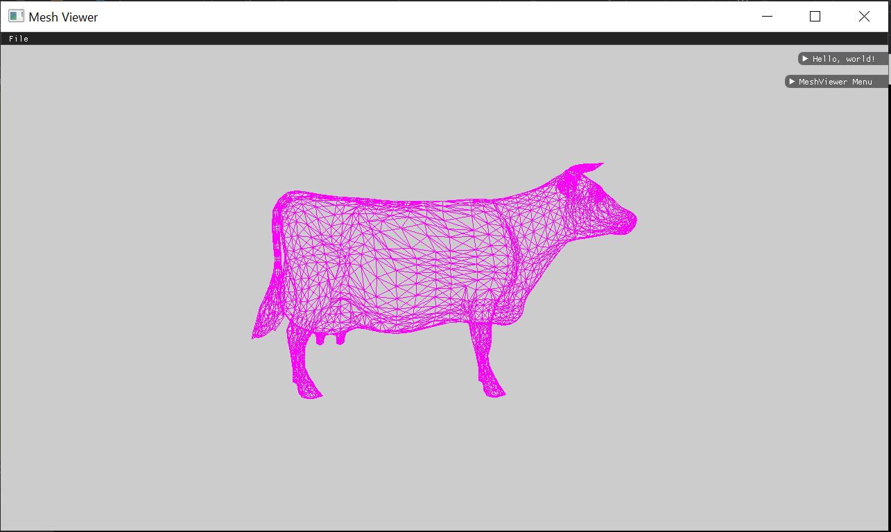
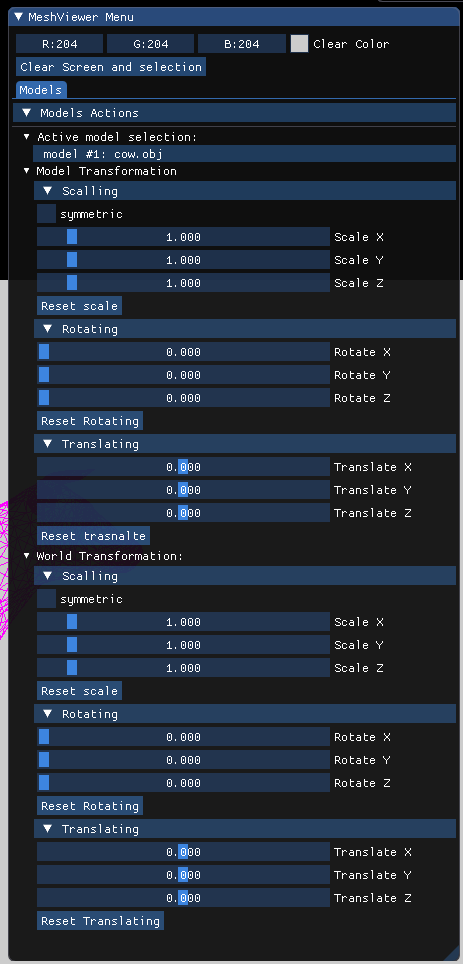
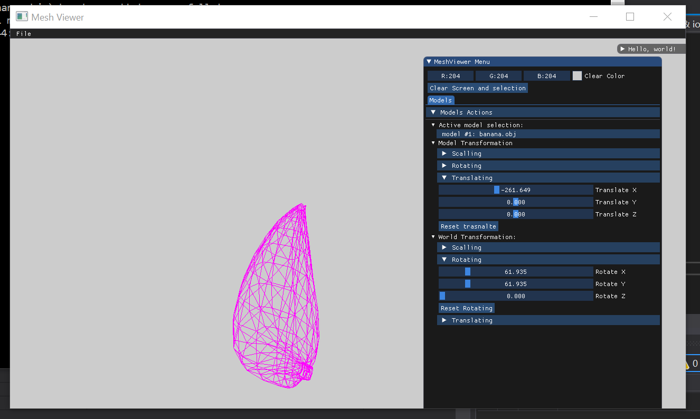
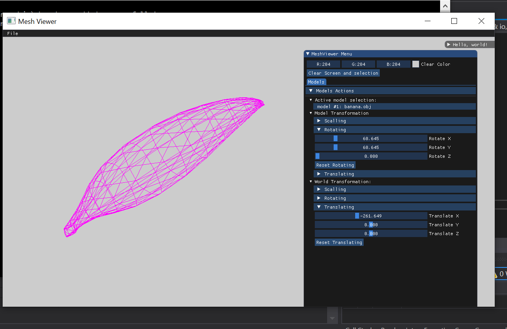

# Assignment 1 Part 2
## Section 1 :
In order to go through all the faces and all their vertices,
I added two functions to the MeshModel class which are:
print_faces() and- print_ver(), and then I called them after loading the mesh model and befor we push it back to the meshModels vector.

print_faces() goes through all the faces, and then with the help of the GetVertexIndex method, we can know the index of the vertices and then know the coordinates through the Victor of The vertices that are within the MeshModel class.

print_ver() goes through all the vertices in the vertices vector and print them.

##### Screenshot of all the faces and the vertices of the demo object : 


---
## Section 2 :

In order to scale and translate the vertices such that they will fit inside the window, I kept the maximum and minimum X and the same for Y and Z when loading the model (in the while loop),
and at the end I keep the maximum of: x_max, y_max, z_max .. so I can do the right scale.. (using the vector (340 / maximum, 340 / maximum, 340 / maximum))

And I want to know the center of the object and change it to be at the origin of the coordinate system (the middle  of the frame), to do that I calculated the center points between the farthest points in each dimension ((min+max)/2 in each dimension) after that I got a point witch represent the center point of the meshModel, we want the center to be in the (0,0,0) to do that we need to translate the object , so I added ( (viewport_width/2) , (viewport_height / 2) ) at rendering time for every vertise, and as a result I got the meshModel at the center of the frame.


---
## Section 3 :
After scaling and translating the MeshModel to the middle of the frame we want to display it on the screen...

So I let the render to go through all the faces and apply all the transformation that we made on every vertice and then I just called the DrawLine function to draw all the lines of the face.



---
## Section 4 :
The user has to load a model, once it's loaded the GUI let you to chose the model you want to play with (if you load more than object) and make it the active model, and then two option is opened, one for the model transformation andthe second one for the World transformation. each transformation has three options one for each dimension as you see in the screenshot below. 

So I added two matrices for each kind of transformation (one for the world frame and the second for the local frame), and one matrix (for each warld and local transformations)for the multiply of the matrices of the various kinds of transformations... so to get the final transformation I multiply the matrices in this way: 

LocalTransformMatrix = (translate * scale * rotateZ * rotateY * rotateX)

WorldTransformMatrix = (inverse(translate) * inverse(scale) * inverse(rotateZ) * inverse(rotateY) * inverse(rotateX))

Transformatio = WorldTransformMatrix * LocalTransformMatrix * VertexVector



---
## Section 5 :
### 1) A screenshot of translating in the model frame and then rotating in the world frame :



### 2) A screenshot of  translating in the world frame and then rotating in the local frame :


---
##### section 6 is for  pairs only put I did it :) so you can load more than object and you can easily switch between them... and each object have his own parameters and matrices.
---
## Section 7 :

Now the user can translate the object to the right or to the left by clicking the right or the left mouse button evenly and the object transformation updated directly by using the previous used function for updating local transformatin as you can see in the code below. 

```	
if (scene.GetModelCount())
{
    MeshModel& Model = scene.GetActiveModel();
    glm::vec3 Translate = Model.getTranslate();		
    // TODO: Handle mouse events here
    if (io.MouseDown[0])
    {
        // Left mouse button is down
        Translate[0] = Translate[0] - 1.0f;
    }
    if (io.MouseDown[1])
    {
        // Right mouse button is down
        Translate[0] = Translate[0] + 1.0f;
    }

    Model.setObjectTransformationUpdates(glm::vec3(1.0f, 1.0f, 1.0f), glm::vec3(0.0f, 0.0f, 0.0f), Translate);
}
```