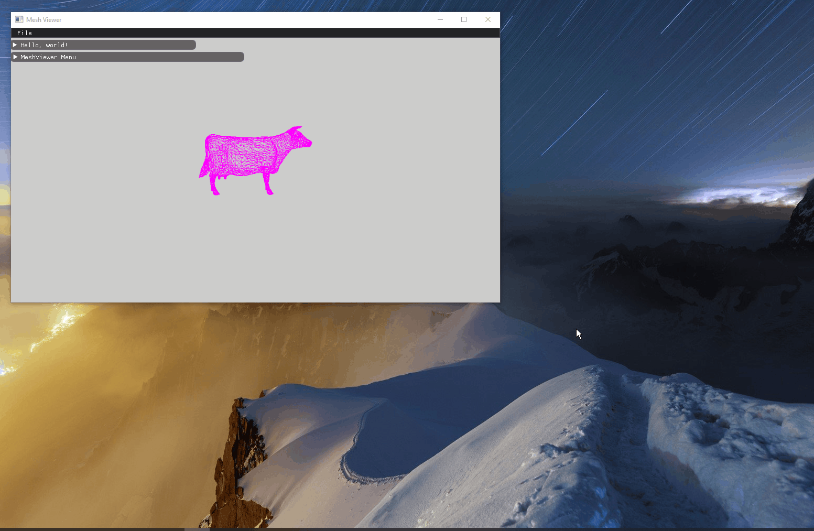
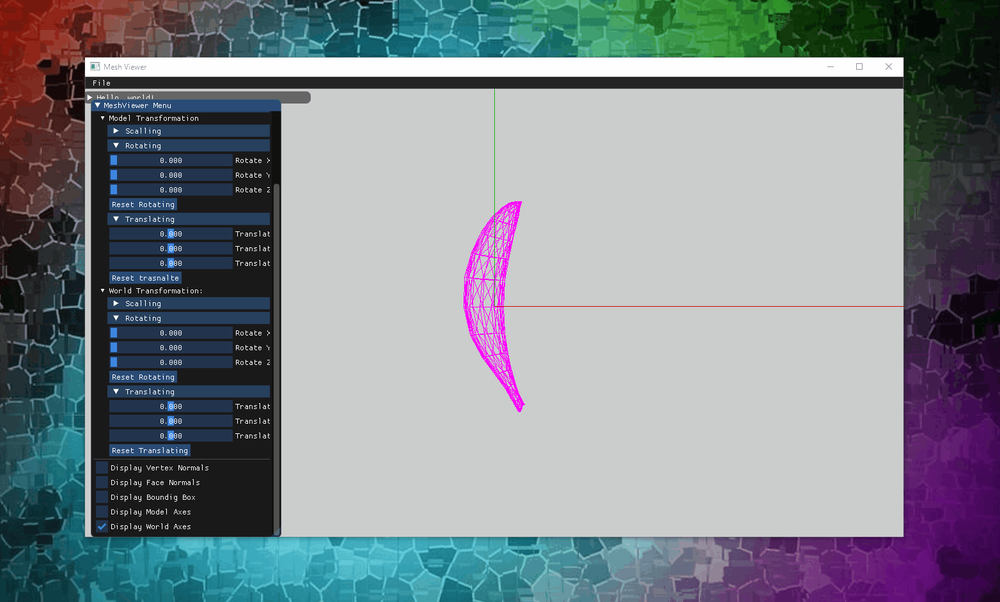
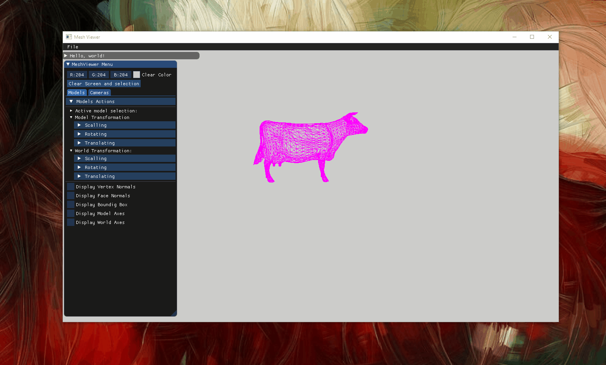
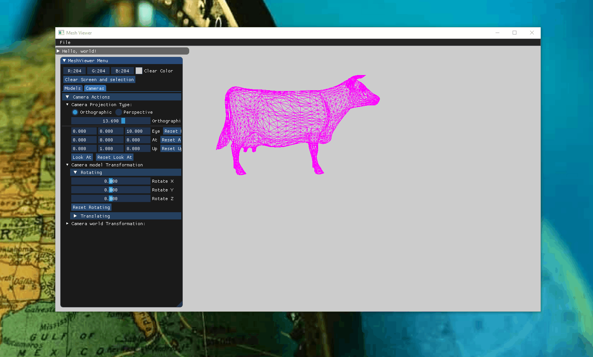
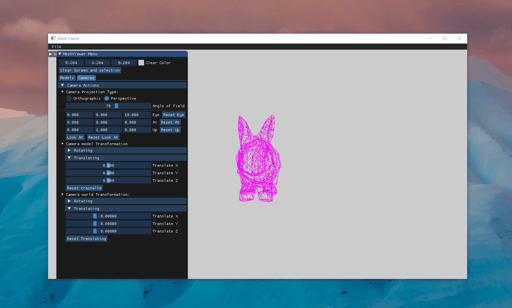
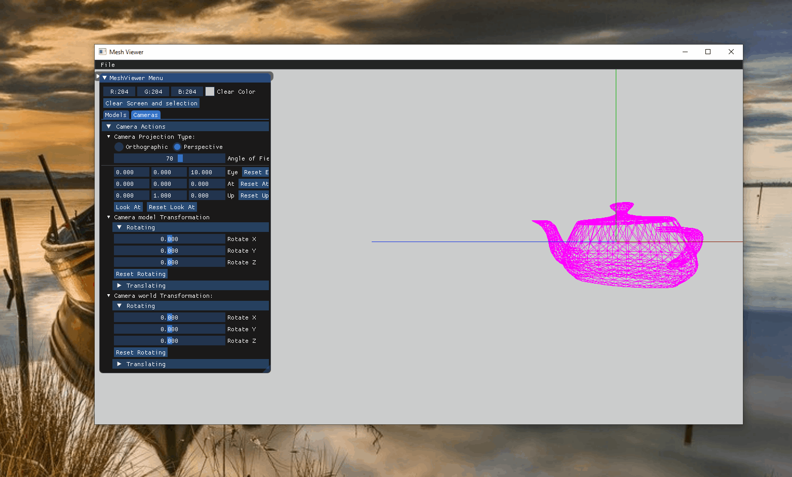
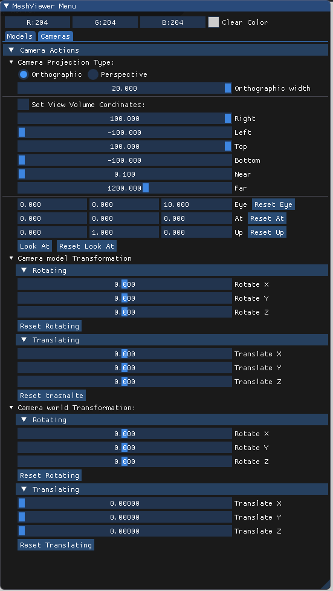
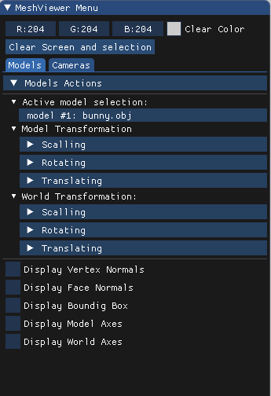

# Assignment1Report_part3 

## Section 1 :

## Section 2 :

Allowing the user to set the view volume automatically based on the window size.

## Section 3 :
Transforming a model in local and warld frame while it's axes are visible : 

## Section 4 :

T1 = translating the model .

T2 = rotating model around X axis and then around Y axis.

## Section 5 :
playing with model while the bounding box, face normals and vertex normals are visible . 

## Section 6 :

## Section 7 :

## Section 8 :

## Section 12 :

#### A Screenshot  of My GUI : 

