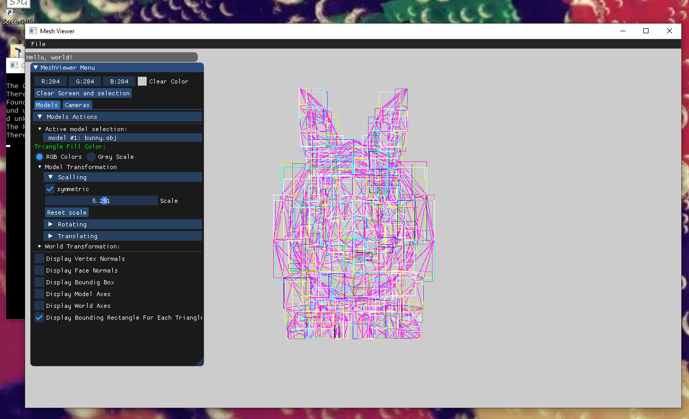
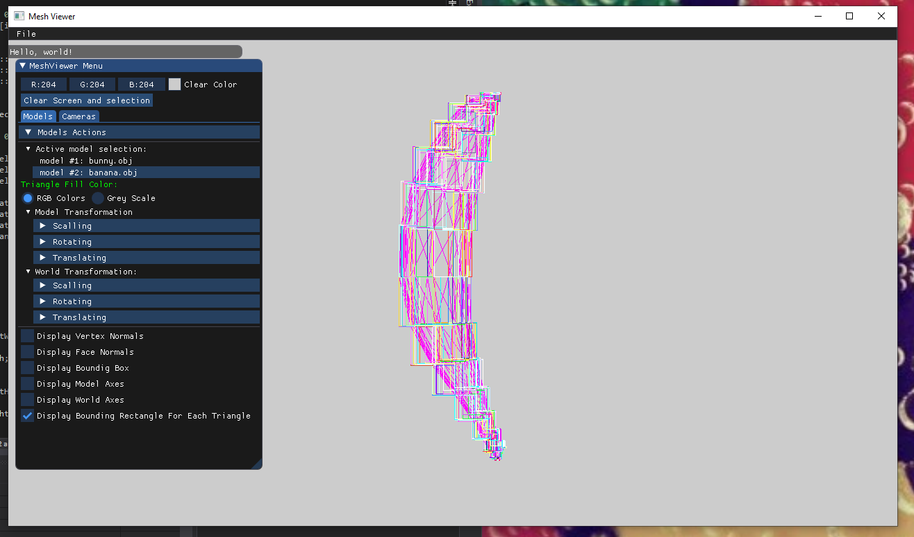
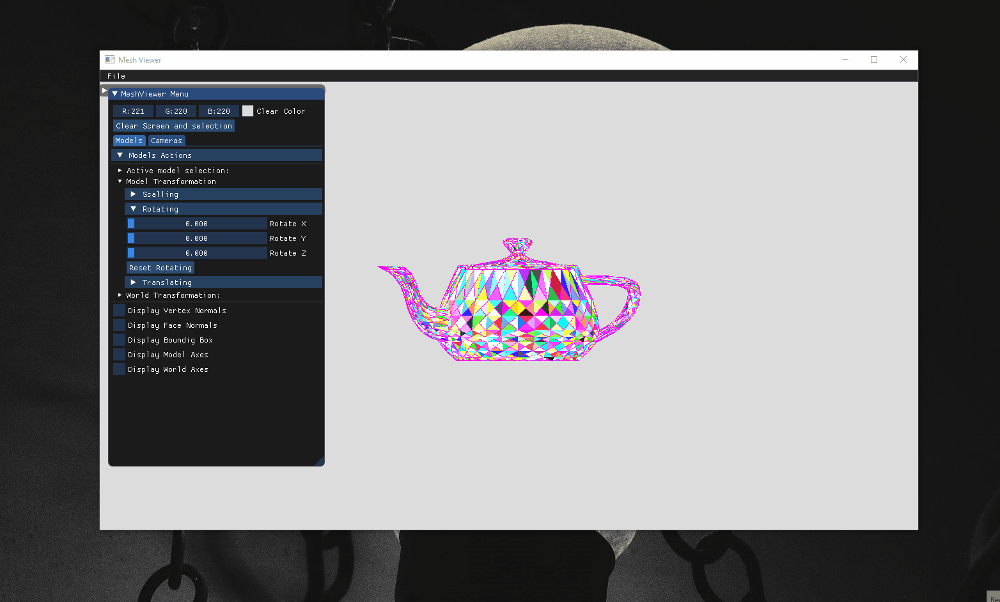
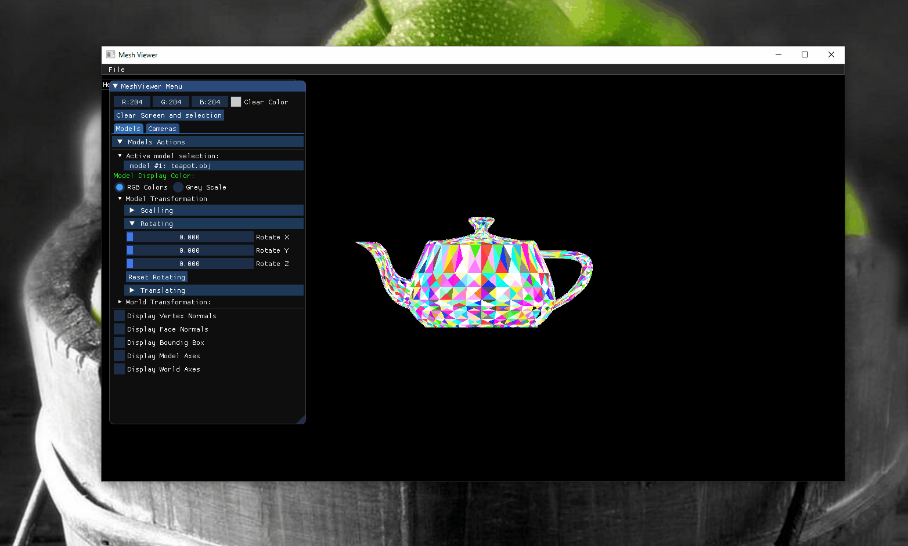
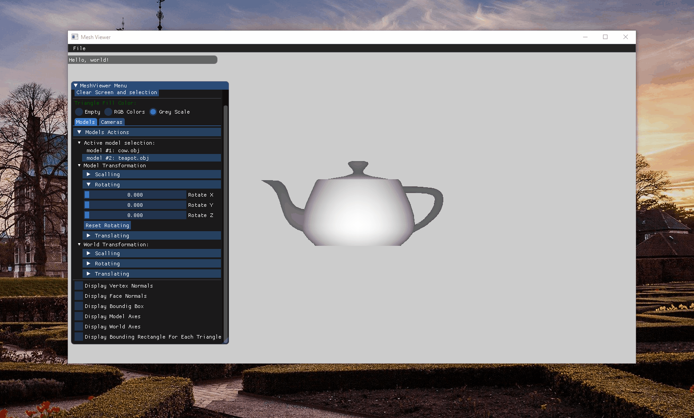
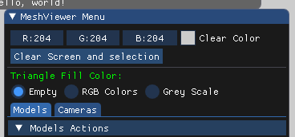
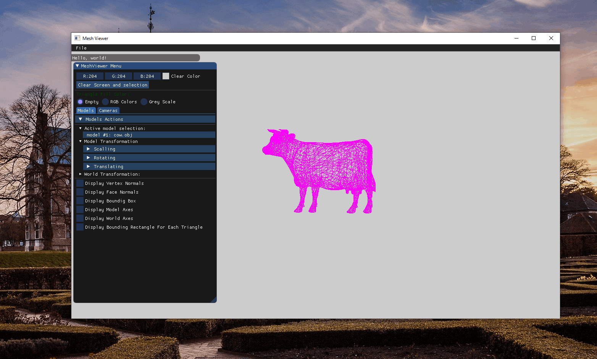

# Assignment 2 Report part1
### Bounding rectangle for each triangle

### Filling every triangle with random color without Z_buffer :

### Filling every triangle with random color with Z_buffer :
##### here because of the z_buffer we cant see the handel when we rotate it to the back of the teapot .

 
 when the model is closer to the screen we can see lighter color but when we go away from the screen the pixel get darker.
(The Teapot face is lighter because it's close to the screen , and when I translate the teapot on z axis I get lighter color when z is bigger and dark colors when z is smaller as shown in the GIF below..)
 

 ---
I added a RadioButton to let the user choose the Triangles filling as shown in the screenshot below :

