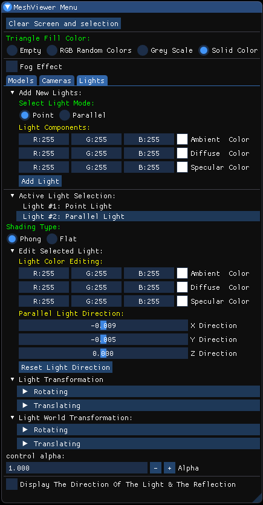
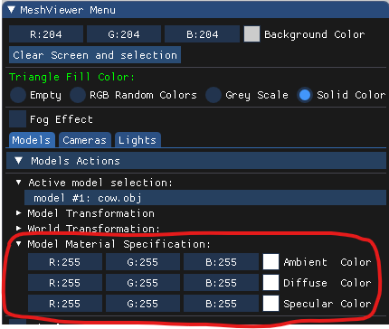
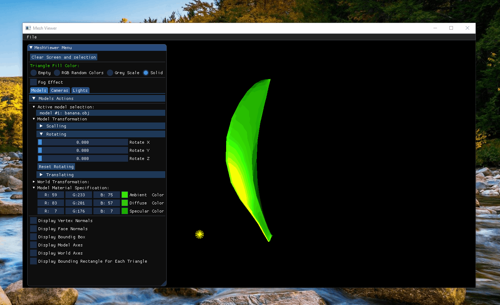
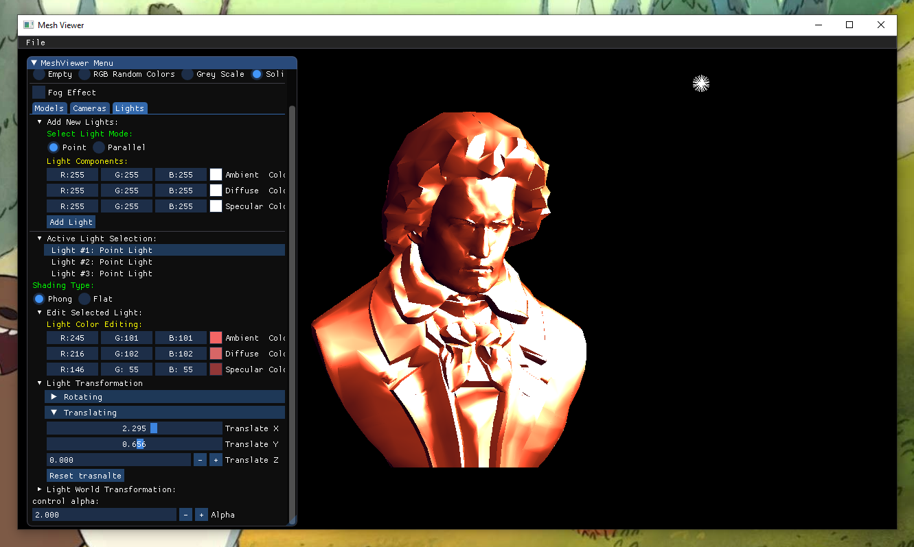
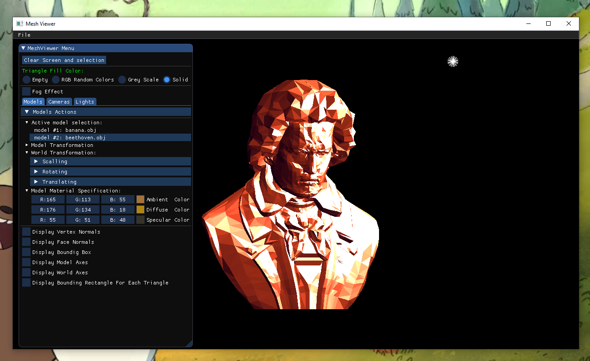
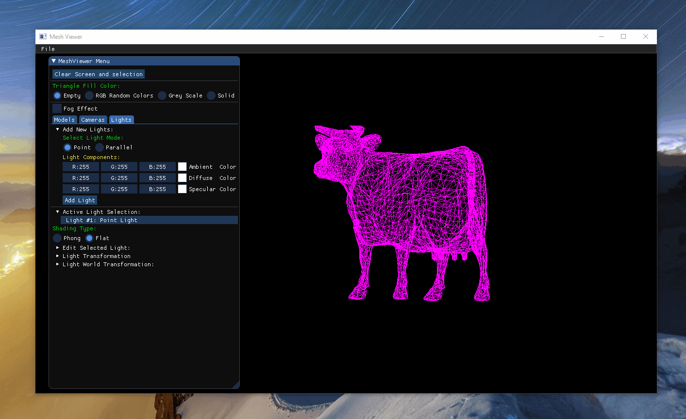
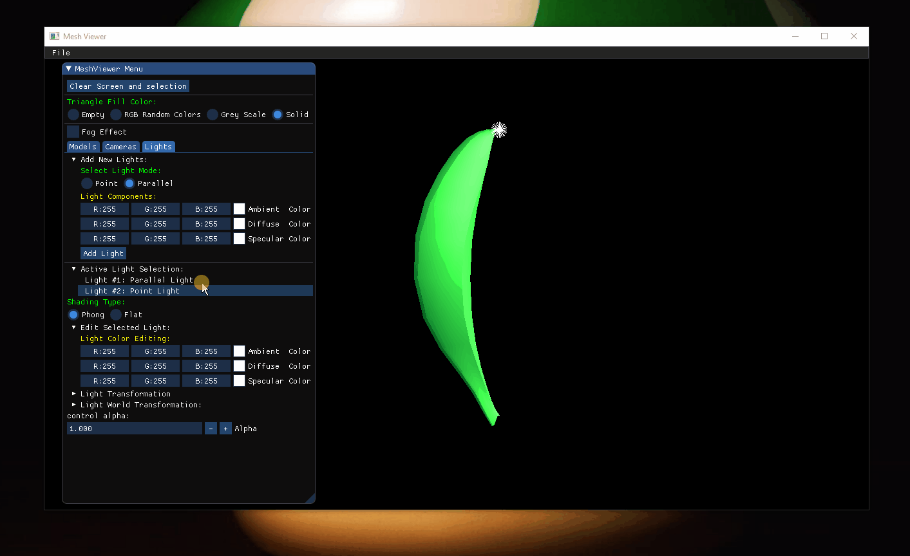

# Assignment 2 Report part 2

## A quick look at the GUI that I  implemented 
The GUI gives the user the ability to add point Lights / parallel Lights and play with it's color, position (rotatation, translation), and the direction of the parallel lights and even the shading type, not to forget that the user can add bunch of lights and select the lighte he want to be active and navigate smoothly between the lights :

and as you can see in the screenshot below the user can also specify the  material color for each model :

---
## **Demonstrations :**
The animation below is an example for white point light on red Teapoat with Flat and Phong shading : 
+ Red Teapoat Material Color : 
    + Ambient (255, 15, 0)  
    + Diffuse (255, 22, 0) 
    + Specular (194, 23, 23)

In the Flat shading every face colord with a uniform intensity, but in the Phong shading a normal vector is linearly interpolated accross the surface of the polygon from the polygon's vertex normals, The surface normal is interpolated and normalized at each pixel to obtain the final pixel color.

Now the same red Teapot but with different point lights color :

### Another Examples with different model and colors :
 And here is the color components for the green banana and the yellow point light, :

- Model Material Color  (green components) : 
    - Ampiant (59, 233, 75).
    - Diffuse (83, 201 57). 
    - Specular (7, 176, 7).

- Point light color (yellow components) :
    - Ampiant (243, 250, 5).
    - Diffuse (246, 254, 4). 
    - Specular (234, 249, 2).

Point light on *Bethoven*, the first photo with Phong shading, and the second one with Flt shading ( same light and same material color on both images ) :

The next animation is a dimonstration of the function that computes the reflection vector used for specular lighting :

(its similar to how we implemented the function that draws the normal vectors in the first assignment but I replaced the normal vectors from before  with the r vector from the specular lights to drwa the reflection rays and the direction vector to draw the light direction rays )

The direction of the light and the directiion of the reflected light of every face is depending on the light position and the center of the face.

- **Green** lines = the **incoming light** ray  (light direction vector) .

 - **Red** lines = the **reflected light** ray .

---

## *Fog Effect :*

 I implement a Fog effect function in Renderer Class, according to the formula in the lecture, and here is the result :

---
## __*As Extra*__
I Implemented the Gouraud shading and the directional light just to see the difference between the Phong and the Gouraud shading, as well to see the difference between the Point light and the Parallel light.   

White __*Parallel light*__ with the same green banana from before  :

The animation below describe  the __difference__  between the __*Phong shading*__ and the __*Gouraud shading*__ :
